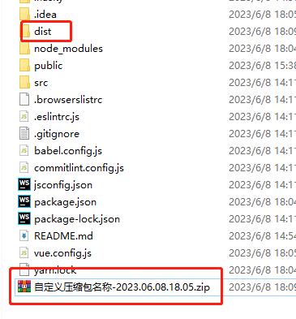

# 使用filemanager-webpack-plugin2.0.5版本vue2打包dist包之后生成zip压缩包
根据项目的package.json里面的配置打包成name-verson-time
test
## npm 库地址
https://www.npmjs.com/package/filemanager-vue2-dist-zip

## Install

` npm install filemanager-vue2-dist-zip -D `

## vue2.x项目打包的时候，直接压缩dist生成zip
> zipPlugin 可传入自定义的包名 与outputDir 保持一致,
> 
> 如： zipPlugin('dist2')
> 
> 默认dist文件名

`输出内容 {
plugin: plugin, // 压缩函数
name: packageData.name  // package.json文件中对应的name的值 
extract,  // 时间格式化 输出结果为 2023.05.06.17.13
name: packageData.name,
time // 返回打出来的zip的包的时间
}`
- 在vue.config.js中

`const {plugin , name } = require('filemanager-vue2-dist-zip')`

`
configureWebpack: {
devtool,
plugins: process.env.NODE_ENV === 'production' ? [zipPlugin('cppcc-data-exchange-shanxi')] : []
}
`

